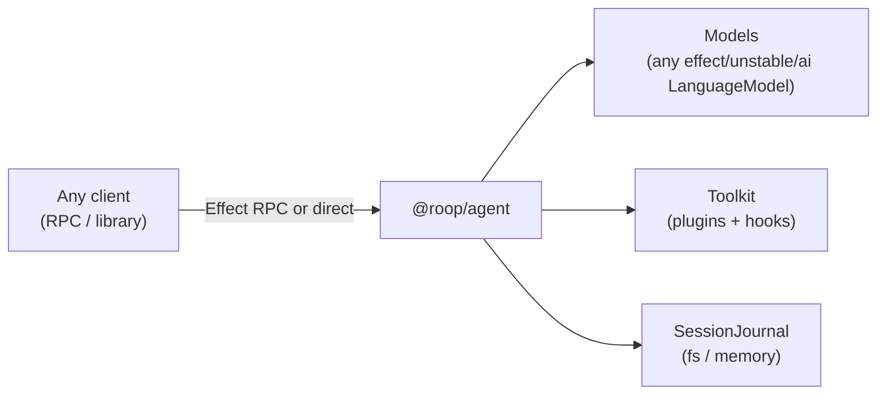

# roop

An Effect-native framework for durable AI agents: an Effect-idiomatic take on the agent-harness
layer. Compose an agent from models, tools, hooks, and subagents; every session is a durable,
resumable, forkable event journal; the kernel runs anywhere Effect runs (Node, Cloudflare Workers,
browsers).

The core agent loop (`@roop/agent`) is portable and depends only on `effect` and
`effect/unstable/ai`. Models, tools, and persistence are Effect layers — bring your own, or use the
in-box ones.

## Quick Start

### Prerequisites

- Node.js 24 (`24.15.0`)
- pnpm 11
- Git

### Installation

```bash
git clone https://github.com/saiashirwad/roop.git
cd roop

corepack enable
pnpm install
```

## Architecture

The kernel decouples the agent loop from models, storage, and I/O:



Capabilities follow a three-role service pattern:

1. **Definition**: Service tag (`SessionJournal`, `ModelCatalog`).
2. **Consumer**: Tools and handlers declare requirements in their environment.
3. **Provider**: Application layers provide the implementation (durable fs journal vs. in-memory,
   scripted test model vs. live provider).

### Composing an Agent

A complete agent is one composition. This is the same shape proven inside Cloudflare Workers by
`packages/agent/test-workerd/`:

```ts
import { Agent, AgentLiveToolkit } from "@roop/agent/Agent.ts"
import { cryptoWeb } from "@roop/agent/cryptoWeb.ts"
import { SessionJournalMemory } from "@roop/agent/SessionJournal.ts"
import { Effect, Layer, Schema } from "effect"
import { Tool, Toolkit } from "effect/unstable/ai"

const Ping = Tool.make("ping", {
  description: "reply with ok",
  parameters: Schema.Struct({}),
  success: Schema.Struct({ ok: Schema.Boolean }),
})

const PingToolkit = Toolkit.make(Ping)

export const agentLayer = AgentLiveToolkit(PingToolkit, {
  systemPrompt: "You ping things.",
  models: [
    {
      id: "my-model",
      provider: "any",
      layer: myLanguageModelLayer, // any LanguageModel layer, e.g. @effect/ai-openai
    },
  ],
}).pipe(
  Layer.provide(SessionJournalMemory),
  Layer.provide(cryptoWeb),
  Layer.provide(
    PingToolkit.toLayer({
      ping: () => Effect.succeed({ ok: true }),
    }),
  ),
)

// Usage: yield* Agent.prompt({ prompt: "ping it", sessionId: "s1" })
```

Swap `SessionJournalMemory` for `SessionJournalFs(".roop/sessions")` for durable journals that
resume after restarts. Compose `Plugin`s for richer toolkits, `AgentHooks` for lifecycle
interception, and `subagent()` for delegation — see `packages/agent/test/` for worked examples.

## Packages

| Package                                   | Description                                                      |
| ----------------------------------------- | ---------------------------------------------------------------- |
| [`@roop/agent`](./packages/agent)         | Portable agent loop, sessions, hooks, and subagent orchestration |
| [`@roop/agent-rpc`](./packages/agent-rpc) | RPC schema and HTTP/NDJSON transport for any composed agent      |

## Development

```bash
pnpm check      # Run typecheck, tests, and linter
pnpm test       # Run test suite
pnpm lint       # Run oxlint
pnpm format     # Run oxfmt
```

`@roop/agent` is checked for environment portability and may only import `effect`,
`effect/unstable/ai`, and local modules.

## License

MIT
