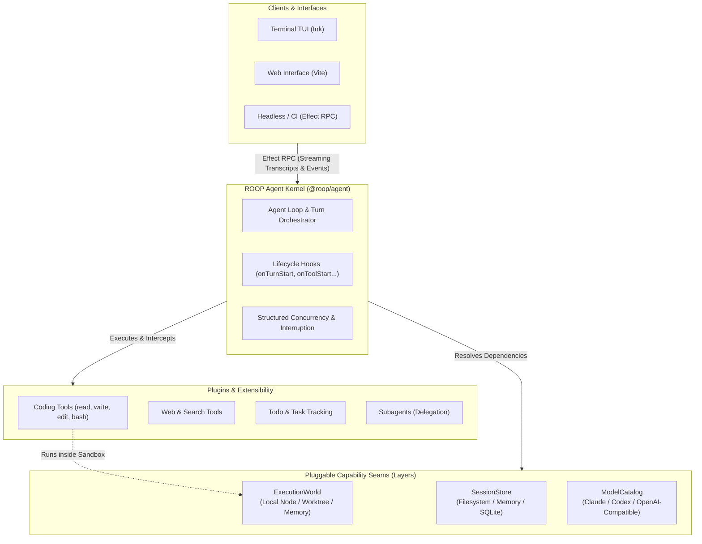

# ROOP

> **Composable, type-safe, Effect-native agent runtime.**

ROOP is an agent runtime built on [Effect](https://effect.website). It decouples the core agent loop from models, tools, sandboxes, and client transports, providing typed capabilities, structured concurrency, zero-overhead edge portability, and streaming Effect RPC out of the box.

---

## Key Highlights

- **Effect-Native & Typed Throughout:** Built with typed errors, typed requirements (`Effect<A, E, R>`), structured concurrency, and resource management.
- **Portability First:** The agent kernel (`@roop/agent`) depends only on `effect` and `effect/unstable/ai`—running identically across Node, Cloudflare Workers / `workerd`, Deno, Bun, and browsers.
- **Strict Capability Seams:** Capability interfaces follow a three-role discipline:
  1. *Definition:* Pure `Context.Service` tags (`ExecutionWorld`, `SessionStore`, `ModelCatalog`).
  2. *Consumer:* Tools and handlers express dependencies in their Effect environment.
  3. *Provider:* Layer compositions provide capabilities (local Node, isolated worktrees, in-memory mocks, remote sandboxes).
- **Atomic Sandbox Swapping:** Point the agent to the host filesystem, an isolated worktree, or an in-memory virtual filesystem with a 1-line `Layer` change.
- **Clean Interruption & Concurrency:** Built on Effect fibers. Halting or interrupting a turn cancels active tool processes, model streams, and subagent trees cleanly without leaking background state.
- **Protocol-First (Effect RPC):** Streaming bidirectional communication between the agent engine and UIs (terminal TUI, web interface, headless runner).
- **Modular Plugins & Lifecycle Hooks:** Extend agents with tools, prompt injectors, subagents, and intercept execution using typed hooks (`onTurnStart`, `onToolStart`, `onModelResponse`, `onTurnEnd`).

---

## Architecture



---

## Workspace Packages

| Package | Description |
|---|---|
| [`@roop/agent`](./packages/agent) | Portable core agent kernel, loop runner, and lifecycle hooks |
| [`@roop/agent-rpc`](./packages/agent-rpc) | Type-safe Effect RPC schemas, HTTP/WebSocket server, and client |
| [`@roop/coding-tools`](./packages/coding-tools) | File, bash, and search tools backed by `ExecutionWorld` |
| [`@roop/coding-harness`](./packages/coding-harness) | Full agent composition with RPC server and CLI runner |
| [`@roop/coding-tui`](./packages/coding-tui) | Interactive terminal UI powered by Ink and Effect RPC |
| [`@roop/coding-web`](./packages/coding-web) | Real-time web transcript and tool visualization UI |
| [`@roop/plugin-claude`](./packages/plugin-claude) | Anthropic Claude model adapter |
| [`@roop/plugin-codex`](./packages/plugin-codex) | Codex model adapter |
| [`@roop/plugin-openai`](./packages/plugin-openai) | OpenAI and OpenAI-compatible provider adapter |
| [`@roop/plugin-skills`](./packages/plugin-skills) | Skills directory loader and prompt injector |
| [`@roop/plugin-todo`](./packages/plugin-todo) | Task and todo tracking plugin |
| [`@roop/plugin-web`](./packages/plugin-web) | Web search and scraping tools |

---

## Quick Example

### Composing an Agent with Plugins

```typescript
import { AgentPlugins } from "@roop/agent/Plugin.ts"
import { SessionStoreFs } from "@roop/agent/SessionStore.ts"
import { subagent } from "@roop/agent/subagent.ts"
import { CodingTools } from "@roop/coding-tools/CodingTools.ts"
import { ExecutionWorld } from "@roop/coding-tools/ExecutionWorld.ts"
import { Claude } from "@roop/plugin-claude/Claude.ts"
import { Todos } from "@roop/plugin-todo/Todos.ts"
import { WebTools } from "@roop/plugin-web/WebTools.ts"
import { NodeChildProcessSpawner, NodeCrypto, NodeFileSystem, NodePath } from "@effect/platform-node"
import { Layer } from "effect"

const codingTools = CodingTools()
const webTools = WebTools()

// 1. Compose plugins & capabilities into an Agent layer
export const agentLayer = AgentPlugins([
  codingTools,
  webTools,
  Todos(),
  Claude(),
  subagent({
    name: "delegate",
    description: "Delegate a task to a specialized subagent.",
    plugins: [codingTools, Claude()],
    maxTurns: 20,
  }),
]).pipe(
  Layer.provide(SessionStoreFs("./.roop/sessions")),
  Layer.provide(ExecutionWorld.local("./workspace")),
  Layer.provide(NodeChildProcessSpawner.layer),
  Layer.provide(NodeCrypto.layer),
  Layer.provide(NodeFileSystem.layer),
  Layer.provide(NodePath.layer),
)
```

---

## Seamless Environment Swapping

Tools depend on the `ExecutionWorld` service tag, making it easy to swap environments between host directories, isolated worktrees, or in-memory mocks:

```typescript
// 1. Local workspace directory
const LocalLayer = ExecutionWorld.local("./my-project")

// 2. Isolated Git worktree sandbox
const WorktreeLayer = ExecutionWorld.worktree({ baseDir: "/tmp/sandboxes" })

// 3. Pure in-memory mock for zero-IO unit tests
const TestLayer = ExecutionWorld.memory({
  files: {
    "src/index.ts": "export const greet = () => 'Hello, world!'",
  },
})
```

---

## Getting Started

### 1. Install & Typecheck

```sh
pnpm install
pnpm typecheck
```

### 2. Run the Coding Harness

Start the HTTP / Effect RPC server:

```sh
pnpm --filter=@roop/coding-harness serve
```

### 3. Connect a Client

Start the interactive terminal UI:

```sh
pnpm --filter=@roop/coding-tui start
```

Or run the web client:

```sh
pnpm --filter=@roop/coding-web dev
```

---

## License

MIT
