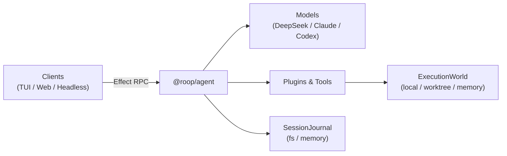

# roop

An Effect-native coding agent runtime.

The core agent loop (`@roop/agent`) is portable and depends only on `effect` and
`effect/unstable/ai`. Capabilities like execution environments, model providers, session
persistence, and client interfaces are provided as Effect layers.

## Quick Start

### Prerequisites

- Node.js 24 (`24.15.0`)
- pnpm 11
- Git

### Installation

```bash
git clone https://github.com/saiashirwad/roop.git
cd roop

corepack enable
pnpm install
```

### Running the Harness

```bash
export DEEPSEEK_API_KEY="your-key"

# Start the RPC server (defaults to http://localhost:8787)
pnpm --filter @roop/coding-harness serve
```

In another terminal, connect with the TUI or web client:

```bash
# Terminal client
pnpm --filter @roop/coding-tui start

# Web client
pnpm --filter @roop/coding-web dev
```

## Architecture

The system decouples the agent loop from execution environments and I/O:



Capabilities follow a three-role service pattern:

1. **Definition**: Service tag (`ExecutionWorld`, `SessionJournal`).
2. **Consumer**: Tools and plugins declare requirements in their environment.
3. **Provider**: Application layers provide the implementation (e.g. local directory vs. ephemeral
   Git worktree vs. in-memory virtual filesystem).

### Example: Composing an Agent

```ts
import {
  NodeChildProcessSpawner,
  NodeCrypto,
  NodeFileSystem,
  NodePath,
} from "@effect/platform-node"
import { AgentPlugins } from "@roop/agent/Plugin.ts"
import { SessionJournalFs } from "@roop/agent/SessionJournal.ts"
import { subagent } from "@roop/agent/Subagent.ts"
import { CodingTools } from "@roop/coding-tools/CodingTools.ts"
import { ExecutionWorld } from "@roop/coding-tools/ExecutionWorld.ts"
import { Claude, Todos } from "@roop/plugins"
import { Layer } from "effect"

const coding = CodingTools()
const claude = Claude()

export const agentLayer = AgentPlugins([
  coding,
  Todos(),
  claude,
  subagent({
    name: "delegate",
    description: "Delegate an isolated task to a subagent.",
    plugins: [coding, claude],
    layer: ExecutionWorld.worktreeFromParent(),
    policy: { maxTotalSteps: 25 },
  }),
]).pipe(
  Layer.provide(SessionJournalFs(".roop/sessions")),
  Layer.provide(ExecutionWorld.local(process.cwd())),
  Layer.provide(NodeChildProcessSpawner.layer),
  Layer.provide(NodeCrypto.layer),
  Layer.provide(NodeFileSystem.layer),
  Layer.provide(NodePath.layer),
)
```

## Packages

| Package                                             | Description                                                                     |
| --------------------------------------------------- | ------------------------------------------------------------------------------- |
| [`@roop/agent`](./packages/agent)                   | Portable agent loop, sessions, hooks, and subagent orchestration                |
| [`@roop/agent-rpc`](./packages/agent-rpc)           | RPC schema and HTTP/NDJSON transport                                            |
| [`@roop/coding-tools`](./packages/coding-tools)     | Workspace-scoped filesystem and shell tools                                     |
| [`@roop/coding-harness`](./packages/coding-harness) | Example agent composition and RPC server                                        |
| [`@roop/coding-tui`](./packages/coding-tui)         | Terminal client built with `pi-tui`                                             |
| [`@roop/coding-web`](./packages/coding-web)         | Web client (React, Vite)                                                        |
| [`@roop/plugins`](./packages/plugins)               | Model adapters (OpenAI, Claude, Codex) and utilities (skills, todos, web fetch) |

## Development

```bash
pnpm check      # Run typecheck, tests, and linter
pnpm test       # Run test suite
pnpm lint       # Run oxlint
pnpm format     # Run oxfmt
```

`@roop/agent` is checked for environment portability and may only import `effect`,
`effect/unstable/ai`, and local modules.

## License

MIT
