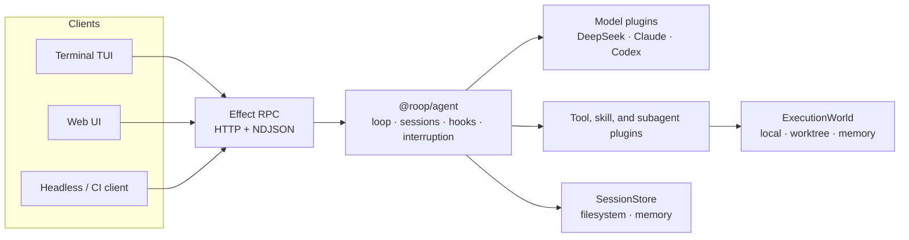

# roop

roop is an Effect runtime for coding agents.

- Runs the agent loop and streams model output.
- Calls tools and starts subagents.
- Records session history.
- Provides models, tools, session storage, and command execution through plugins or Effect services.

The project is under active development. Workspace packages are private, and public APIs are not stable.

[Quick start](#quick-start) · [Architecture](#architecture) · [Core concepts](#core-concepts) · [Packages](#packages) · [Development](#development)

## Design

`@roop/agent` contains the portable agent loop. It imports only `effect` and `effect/unstable/ai`; the portability test also runs it in `workerd`.

Application layers provide the platform-specific parts:

- a local repository, Git worktree, or in-memory files for tool execution
- a filesystem or memory-backed session store
- a DeepSeek, Claude, Codex, or other model adapter
- a terminal, web, or headless RPC client

Plugins add tools, handlers, models, skills, prompt sections, subagents, and lifecycle hooks.

## Quick start

### Requirements

- Node.js 24. The repository pins `24.15.0` with [mise](https://mise.jdx.dev/).
- pnpm 11. The repository declares `pnpm@11.10.0`.
- Git.
- A DeepSeek API key for the included coding harness.

### Install

```bash
git clone https://github.com/saiashirwad/roop.git
cd roop

corepack enable
pnpm install
```

The install step fetches the Effect source into `.repos/effect` for local tooling.

### Start the agent server

```bash
export DEEPSEEK_API_KEY="your-key"
export HARNESS_ROOT="/path/to/project" # Optional. Defaults to the current directory

pnpm --filter @roop/coding-harness serve
```

The harness exposes Effect RPC at `http://localhost:8787/rpc` and writes session logs to `<HARNESS_ROOT>/.roop/sessions`.

### Connect a client

Start the terminal client:

```bash
pnpm --filter @roop/coding-tui start
```

Or start the web client:

```bash
pnpm --filter @roop/coding-web dev
```

The web development server proxies `/rpc` requests to `HARNESS_URL`, which defaults to `http://localhost:8787`.

In the TUI, `/models` lists models and `/models <id>` changes the active model. Press `Esc` to interrupt a run and `Ctrl+C` to quit. `/skills`, `/tools`, `/new`, and `/help` are also available.

### Included model adapters

| Adapter | Default model | Authentication |
| --- | --- | --- |
| OpenAI-compatible / DeepSeek | `deepseek-chat` | `DEEPSEEK_API_KEY` |
| Claude | `sonnet` | Authenticated local `claude` CLI |
| Codex | `gpt-5-codex` | Authenticated local `codex` CLI |

> [!WARNING]
> `ExecutionWorld.local` scopes workspace paths. It is not an operating-system security sandbox. The included `bash` tool has the host process's permissions. A Git worktree separates repository state, not process access. Do not run untrusted prompts or code until you provide a hardened `ExecutionWorld`.

## Architecture



A capability has three roles:

1. Define an Effect service such as `ExecutionWorld` or `SessionStore`.
2. Consume the service from tools, hooks, or handlers through the Effect environment.
3. Provide an implementation in the application layer.

The agent loop has no dependency on Node.js, a filesystem layout, a model vendor, or a client interface. An application can replace a local workspace with a Git worktree by changing the provided layer.

## Core concepts

### Plugins

`AgentPlugins` combines static and runtime plugin contributions into one agent layer. A plugin may define typed tools and handlers, model implementations, skills and prompt sections, hook stages, or nested subagents.

```ts
import {
  NodeChildProcessSpawner,
  NodeCrypto,
  NodeFileSystem,
  NodePath,
} from "@effect/platform-node"
import { AgentPlugins } from "@roop/agent/Plugin.ts"
import { SessionStoreFs } from "@roop/agent/SessionStore.ts"
import { subagent } from "@roop/agent/subagent.ts"
import { CodingTools } from "@roop/coding-tools/CodingTools.ts"
import { ExecutionWorld } from "@roop/coding-tools/ExecutionWorld.ts"
import { Claude } from "@roop/plugin-claude/Claude.ts"
import { Todos } from "@roop/plugin-todo/Todos.ts"
import { Layer } from "effect"

const coding = CodingTools()
const claude = Claude()

export const agentLayer = AgentPlugins([
  coding,
  Todos(),
  claude,
  subagent({
    name: "delegate",
    description: "Delegate an isolated coding task to a subagent.",
    plugins: [coding, claude],
    layer: ExecutionWorld.worktreeFromParent(),
    maxTurns: 25,
  }),
]).pipe(
  Layer.provide(SessionStoreFs(".roop/sessions")),
  Layer.provide(ExecutionWorld.local(process.cwd())),
  Layer.provide(NodeChildProcessSpawner.layer),
  Layer.provide(NodeCrypto.layer),
  Layer.provide(NodeFileSystem.layer),
  Layer.provide(NodePath.layer),
)
```

Hooks run as a waterfall. `preStep`, `beforeRequest`, `beforeToolExecute`, `afterToolExecute`, and `turnStopping` each intercept a stage of a turn.

### Execution worlds

Coding tools require `ExecutionWorld` rather than Node.js filesystem or process APIs.

```ts
// Work in a local repository
const local = ExecutionWorld.local("/path/to/repo")

// Create a Git worktree. Its scope cleans it up.
const isolated = ExecutionWorld.worktree({
  baseRepo: "/path/to/repo",
})

// Run tests against files held in memory
const memory = ExecutionWorld.memory({
  files: {
    "src/index.ts": "export const answer = 42",
  },
})
```

Built-in file tools reject paths outside the execution root. The execution world also provides the process spawner and optional environment variables for shell commands.

### Sessions and interruption

Every run has a session. The runtime records user messages, model requests, assistant output, tool calls and results, turns, and steps. Session stores persist those records in memory or atomic JSON files. Clients can list and reopen sessions over RPC.

Only one run may own a session at a time. An interrupt request propagates through the model stream, tools, and subagent work.

### Streaming RPC

`@roop/agent-rpc` defines this protocol:

| RPC | What it does |
| --- | --- |
| `Capabilities` | Lists models, tools, skills, and the default model. |
| `Prompt` | Starts a streamed agent run. |
| `Interrupt` | Stops the active run for a session. |
| `GetHistory` | Loads a persisted session. |
| `ListSessions` | Lists sessions by recency. |
| `ForkSession` | Copies a persisted session into a new session. |

The included transport uses Effect RPC over HTTP with NDJSON serialization. The agent engine and clients may run in separate processes.

## Packages

### Runtime

| Package | Responsibility |
| --- | --- |
| [`@roop/agent`](./packages/agent) | Portable agent loop, plugin composition, sessions, hooks, and subagents. |
| [`@roop/agent-rpc`](./packages/agent-rpc) | Effect RPC schema plus HTTP and NDJSON client and server layers. |
| [`@roop/coding-tools`](./packages/coding-tools) | Workspace-scoped `readFile`, `writeFile`, `listFiles`, and `bash` tools. |

### Applications

| Package | Responsibility |
| --- | --- |
| [`@roop/coding-harness`](./packages/coding-harness) | Coding-agent composition and RPC server. |
| [`@roop/coding-tui`](./packages/coding-tui) | Streaming terminal client built with `pi-tui`. |
| [`@roop/coding-web`](./packages/coding-web) | React and Vite client with transcripts, sessions, and tool views. |

### Plugins

| Package | Responsibility |
| --- | --- |
| [`@roop/plugin-openai`](./packages/plugin-openai) | OpenAI-compatible HTTP model adapter. |
| [`@roop/plugin-claude`](./packages/plugin-claude) | Claude adapter backed by the local `claude` CLI. |
| [`@roop/plugin-codex`](./packages/plugin-codex) | Codex adapter backed by the local `codex` CLI. |
| [`@roop/plugin-skills`](./packages/plugin-skills) | Loads `SKILL.md` directories and exposes them through a typed tool. |
| [`@roop/plugin-todo`](./packages/plugin-todo) | Planning through the `writeTodos` tool. |
| [`@roop/plugin-web`](./packages/plugin-web) | HTTP fetching through the `webFetch` tool. |

## Configuration

| Variable | Default | Used by |
| --- | --- | --- |
| `DEEPSEEK_API_KEY` | None | Required by the included harness. |
| `HARNESS_ROOT` | Current working directory | Agent workspace and session location. |
| `HARNESS_URL` | `http://localhost:8787` | Web development proxy. |
| `CLAUDE_SMOKE` | Unset | Enables live Claude adapter smoke tests. |
| `CODEX_SMOKE` | Unset | Enables live Codex adapter smoke tests. |

## Development

Run all local checks:

```bash
pnpm check
```

This command runs workspace type checks and tests, followed by Oxlint and an Oxfmt check. Individual commands are also available:

```bash
pnpm typecheck
pnpm test
pnpm lint
pnpm format
```

`packages/agent` may import only `effect`, `effect/unstable/ai`, and local modules. The portability test enforces it. Put Node-specific code in platform packages and application composition.

## License

MIT
