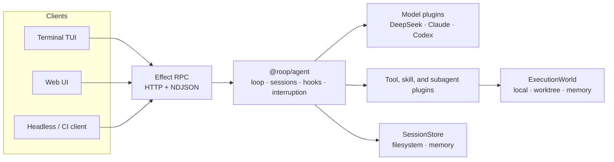

# roop

**An Effect-native runtime for composable coding agents.**

Models, tools, execution environments, session stores, hooks, and clients—assembled as typed Effect
layers.

[Quick start](#quick-start) · [Architecture](#architecture) · [Core concepts](#core-concepts) ·
[Packages](#packages) · [Development](#development)

> [!NOTE] ROOP is under active development. The workspace packages are private and the public APIs
> are not yet stable.

ROOP keeps the agent loop small, typed, and independent of any single model provider or host
runtime. The kernel handles model streaming, tool execution, session journaling, interruption, and
subagent orchestration. Everything else is supplied through explicit plugins and capabilities.

The repository also includes a complete coding-agent composition, an interactive terminal client,
and a browser client.

## Why ROOP

- **Effect all the way down.** Typed errors, explicit requirements, scoped resources, streams,
  fibers, and interruption are part of the runtime rather than wrappers around it.
- **Infrastructure is replaceable.** Switch between a local directory, an isolated Git worktree, or
  an in-memory execution world by changing a `Layer`.
- **The kernel stays portable.** `@roop/agent` imports only `effect` and `effect/unstable/ai`, with
  a test suite that runs the core inside `workerd`.
- **Clients are decoupled from the engine.** The terminal UI, web UI, and headless clients
  communicate through streaming Effect RPC over HTTP with NDJSON serialization.
- **Extensions compose cleanly.** A plugin may contribute tools, handlers, models, skills, prompt
  sections, subagents, or lifecycle hooks without taking ownership of the loop.

## Quick start

### Requirements

- Node.js 24 — the repository pins `24.15.0` through [mise](https://mise.jdx.dev/)
- pnpm 11 — the repository declares `pnpm@11.10.0`
- Git
- A DeepSeek API key for the bundled coding harness

### Install

```bash
git clone https://github.com/saiashirwad/roop.git
cd roop

corepack enable
pnpm install
```

`pnpm install` also fetches the Effect source tree into `.repos/effect` for local Effect-aware
tooling.

### Start the agent server

```bash
export DEEPSEEK_API_KEY="your-key"
export HARNESS_ROOT="/path/to/project" # optional; defaults to the current directory

pnpm --filter @roop/coding-harness serve
```

The harness exposes Effect RPC at `http://localhost:8787/rpc` and persists session logs under
`<HARNESS_ROOT>/.roop/sessions`.

### Connect a client

Run the terminal UI:

```bash
pnpm --filter @roop/coding-tui start
```

Or start the browser client:

```bash
pnpm --filter @roop/coding-web dev
```

The web development server proxies `/rpc` to `HARNESS_URL`, which defaults to
`http://localhost:8787`.

Inside the TUI, use `/models` to inspect available models, `/models <id>` to switch, `Esc` to
interrupt the active run, and `Ctrl+C` to quit. `/skills`, `/tools`, `/new`, and `/help` are also
available.

### Included model adapters

| Adapter                      | Default model   | Authentication                   |
| ---------------------------- | --------------- | -------------------------------- |
| OpenAI-compatible / DeepSeek | `deepseek-chat` | `DEEPSEEK_API_KEY`               |
| Claude                       | `sonnet`        | Authenticated local `claude` CLI |
| Codex                        | `gpt-5-codex`   | Authenticated local `codex` CLI  |

> [!WARNING] `ExecutionWorld.local` is a workspace abstraction, not an operating-system security
> sandbox. The bundled `bash` tool runs with the permissions of the host process, and a Git worktree
> isolates repository state—not process access. Use a hardened `ExecutionWorld` implementation
> before running untrusted prompts or code.

## Architecture



The boundaries are deliberate:

1. **Define** a capability as an Effect service, such as `ExecutionWorld` or `SessionStore`.
2. **Consume** it from tools, hooks, or handlers through the Effect environment.
3. **Provide** the concrete implementation when composing the application layer.

That separation keeps the agent loop unaware of Node.js, the filesystem layout, the model vendor,
and the client interface.

## Core concepts

### Plugins

`AgentPlugins` merges static and runtime contributions into one agent layer. Plugins can provide:

- typed tools and handlers
- language-model implementations
- skills and prompt sections
- hook waterfall stages
- nested subagents

```ts
import {
  NodeChildProcessSpawner,
  NodeCrypto,
  NodeFileSystem,
  NodePath,
} from "@effect/platform-node"
import { AgentPlugins } from "@roop/agent/Plugin.ts"
import { SessionStoreFs } from "@roop/agent/SessionStore.ts"
import { subagent } from "@roop/agent/subagent.ts"
import { CodingTools } from "@roop/coding-tools/CodingTools.ts"
import { ExecutionWorld } from "@roop/coding-tools/ExecutionWorld.ts"
import { Claude } from "@roop/plugin-claude/Claude.ts"
import { Todos } from "@roop/plugin-todo/Todos.ts"
import { Layer } from "effect"

const coding = CodingTools()
const claude = Claude()

export const agentLayer = AgentPlugins([
  coding,
  Todos(),
  claude,
  subagent({
    name: "delegate",
    description: "Delegate an isolated coding task to a subagent.",
    plugins: [coding, claude],
    layer: ExecutionWorld.worktreeFromParent(),
    maxTurns: 25,
  }),
]).pipe(
  Layer.provide(SessionStoreFs(".roop/sessions")),
  Layer.provide(ExecutionWorld.local(process.cwd())),
  Layer.provide(NodeChildProcessSpawner.layer),
  Layer.provide(NodeCrypto.layer),
  Layer.provide(NodeFileSystem.layer),
  Layer.provide(NodePath.layer),
)
```

Hook stages compose as a waterfall and expose focused interception points: `preStep`,
`beforeRequest`, `beforeToolExecute`, `afterToolExecute`, and `turnStopping`.

### Execution worlds

Coding tools depend on `ExecutionWorld`, not directly on Node.js filesystem or process APIs.

```ts
// Work directly in a local repository
const local = ExecutionWorld.local("/path/to/repo")

// Acquire an isolated Git worktree and clean it up with the scope
const isolated = ExecutionWorld.worktree({
  baseRepo: "/path/to/repo",
})

// Run fast tests without touching the host filesystem
const memory = ExecutionWorld.memory({
  files: {
    "src/index.ts": "export const answer = 42",
  },
})
```

The built-in file tools reject paths that escape the execution root. The execution world also owns
the process spawner and optional environment inherited by shell commands.

### Sessions and interruption

Every run is associated with a session. The runtime journals structured events for user messages,
model requests, assistant output, tool calls, tool results, turns, and steps. Sessions can be stored
in memory or as atomic JSON files, listed through RPC, and reopened by clients.

Only one run may own a session at a time. An interrupt request is propagated into the active Effect
computation so in-flight model streams, tools, and subagent work can be stopped through structured
concurrency.

### Streaming RPC

`@roop/agent-rpc` exposes a small protocol:

| RPC            | Purpose                                           |
| -------------- | ------------------------------------------------- |
| `Capabilities` | List models, tools, skills, and the default model |
| `Prompt`       | Start a streamed agent run                        |
| `Interrupt`    | Stop the active run for a session                 |
| `GetHistory`   | Load one persisted session                        |
| `ListSessions` | List sessions by recency                          |
| `ForkSession`  | Copy a persisted session into a new session       |

The bundled transport uses Effect RPC over HTTP with NDJSON serialization, so the agent engine and
its user interfaces remain independently deployable.

## Packages

### Runtime

| Package                                         | Responsibility                                                            |
| ----------------------------------------------- | ------------------------------------------------------------------------- |
| [`@roop/agent`](./packages/agent)               | Portable agent kernel, plugin composition, sessions, hooks, and subagents |
| [`@roop/agent-rpc`](./packages/agent-rpc)       | Effect RPC schema plus HTTP/NDJSON client and server layers               |
| [`@roop/coding-tools`](./packages/coding-tools) | Workspace-scoped `readFile`, `writeFile`, `listFiles`, and `bash` tools   |

### Applications

| Package                                             | Responsibility                                               |
| --------------------------------------------------- | ------------------------------------------------------------ |
| [`@roop/coding-harness`](./packages/coding-harness) | Reference coding-agent composition and RPC server            |
| [`@roop/coding-tui`](./packages/coding-tui)         | Streaming terminal client built with `pi-tui`                |
| [`@roop/coding-web`](./packages/coding-web)         | React/Vite client with transcripts, sessions, and tool views |

### Plugins

| Package                                           | Responsibility                                                     |
| ------------------------------------------------- | ------------------------------------------------------------------ |
| [`@roop/plugin-openai`](./packages/plugin-openai) | Generic OpenAI-compatible HTTP model adapter                       |
| [`@roop/plugin-claude`](./packages/plugin-claude) | Claude adapter backed by the local `claude` CLI                    |
| [`@roop/plugin-codex`](./packages/plugin-codex)   | Codex adapter backed by the local `codex` CLI                      |
| [`@roop/plugin-skills`](./packages/plugin-skills) | Loads `SKILL.md` directories and exposes them through a typed tool |
| [`@roop/plugin-todo`](./packages/plugin-todo)     | Task planning through the `writeTodos` tool                        |
| [`@roop/plugin-web`](./packages/plugin-web)       | Bounded HTTP fetching through the `webFetch` tool                  |

## Configuration

| Variable           | Default                   | Used by                                   |
| ------------------ | ------------------------- | ----------------------------------------- |
| `DEEPSEEK_API_KEY` | —                         | Required by the bundled harness           |
| `HARNESS_ROOT`     | Current working directory | Agent workspace and session location      |
| `HARNESS_URL`      | `http://localhost:8787`   | Web development proxy                     |
| `CLAUDE_SMOKE`     | Unset                     | Opts into live Claude adapter smoke tests |
| `CODEX_SMOKE`      | Unset                     | Opts into live Codex adapter smoke tests  |

## Development

Run the complete local check:

```bash
pnpm check
```

This runs type checking and tests across the workspace, followed by Oxlint and an Oxfmt check.
Useful individual commands are also available:

```bash
pnpm typecheck
pnpm test
pnpm lint
pnpm format
```

A portability test enforces that `packages/agent` imports only `effect`, `effect/unstable/ai`, and
local modules. Node-specific implementations belong in platform-facing packages and application
compositions.

## License

MIT
