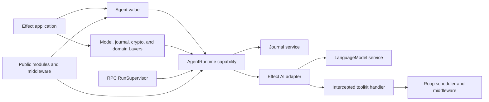
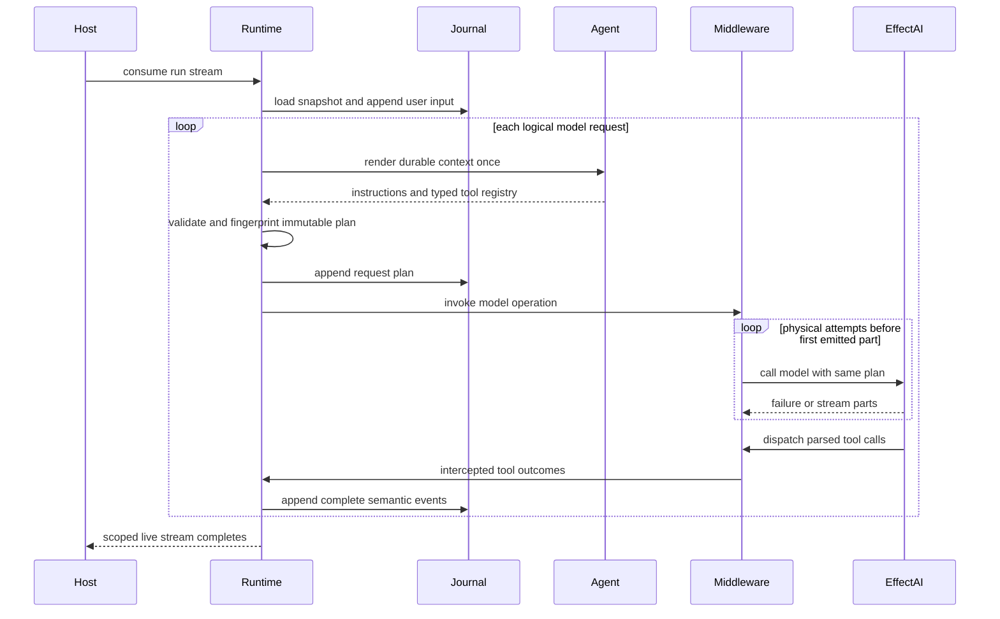
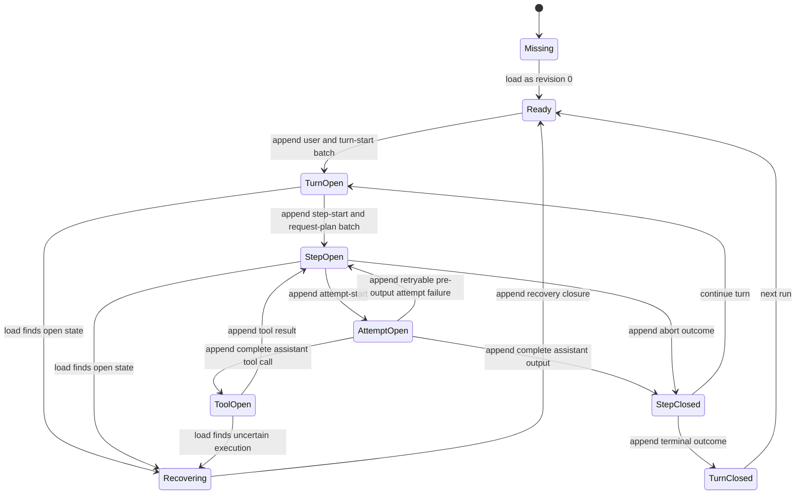
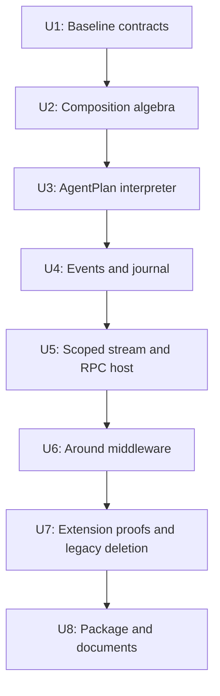

# Effect-Native Agent Kernel Refactor - Plan

## Goal Capsule

- **Objective:** Make Roop a portable and publishable Effect-native agent kernel for Effect
  application developers.
- **Means:** Replace the current plugin and catalogue composition with explicit `Agent` values,
  effectful modules, typed middleware, services, Layers, a scoped run stream, and an append-only
  journal. (KTD1-KTD9)
- **Authority:** The Product Contract controls behavior. The Planning Contract controls
  implementation mechanisms. Repository instructions and the pinned Effect source control local
  conventions and Effect API use.
- **Execution profile:** Refactor the existing kernel in eight small units. Preserve the current
  interpreter behavior before each boundary change.
- **Stop conditions:** Do not add a provider catalogue, database adapter, UI, coding tool, sandbox,
  remote steering API, or exactly-once tool execution.
- **Tail ownership:** The implementation is complete only after the public package installs from a
  packed archive and the RPC consumer uses only public kernel exports.

---

## Product Contract

### Summary

Roop is for an Effect developer who must embed an agent loop in an application without accepting a
second dependency injection system. The developer defines an agent as a value and supplies models,
journals, tool dependencies, middleware dependencies, and host services through Effect. Roop owns
the portable interpreter contract. It does not own providers, databases, transports, deployment, or
product tools.

### Problem Frame

The current repository is already cut down to `packages/agent` and `packages/agent-rpc`. The
remaining kernel still composes tools, hooks, models, skills, and prompt data through `Plugin`,
catalogues, and runtime registries. These structures overlap with Effect services and Layers. They
also hide conflict behavior, widen the public API, and mix an embeddable run with host supervision.

### Key Decisions

- **The first product is the portable kernel for Effect application developers.** Keep
  `packages/agent-rpc` as a host example, not as a kernel dependency. Governs R1, R14, R16.
- **The first release is experimental and can break the current public API.** Use a short internal
  migration bridge only. Do not publish a legacy compatibility layer. Governs R15, R17.
- **The current repository cut is the baseline.** Do not repeat the old product-package deletion
  work. Preserve the pre-cut implementation in git history at `83e4cc7`. Governs R16.

### Actors

- A1. **Effect application developer:** Defines an agent and supplies its runtime environment.
- A2. **Extension author:** Adds tools or policies through documented public seams.
- A3. **Host adapter author:** Adds named supervision, subscriptions, interruption, and transport
  behavior outside the kernel.
- A4. **Agent runtime:** Interprets one explicit agent for one scoped run.
- A5. **Effect AI:** Parses model output and dispatches finalized toolkit handlers.

### Requirements

#### Agent and module composition

- R1. Roop must expose an `Agent` as a named explicit value whose effectful renderer is evaluated
  once before each logical model request.
- R2. Each render must produce an `AgentPlan` that contains only ordered instruction fragments and a
  typed `ToolRegistry`.
- R3. `Module.empty`, `Module.instructions`, `Module.tool`, `Module.all`, and `Module.when` must
  preserve inferred service requirements in `R` and failures in `E`.
- R4. `Module.provide` and `Module.provideLayer` may enter the initial public API only after
  compile-only tests prove that supplied services leave `R` and Layer failures remain in `E`.
- R5. Instruction fragments must keep declaration order, omit empty fragments, and compile to one
  model-facing system message.
- R6. Tool contributions must collect before validation. Duplicate names must produce one
  deterministic `ToolConflict` that identifies all contributors and does not change when the same
  ordered modules are regrouped.

#### Model, tool, and middleware execution

- R7. The run must require `LanguageModel.LanguageModel` as an Effect service. The kernel must not
  contain a model catalogue, provider metadata, string model selection, or a default model.
- R8. A logical model request must use one rendered plan and one plan fingerprint. Physical retry or
  fallback attempts must reuse that plan.
- R9. Effect AI must parse tool calls and dispatch the installed toolkit handler. Roop must
  intercept that handler and remain the sole owner of approval, scheduling, correlation, timeout
  policy, output limits, middleware, and live events.
- R10. Declared tool-domain failures and policy denials must become model-visible failed tool
  results. Model, journal, scheduler, middleware, and other infrastructure failures must remain in
  the run error channel.
- R11. Middleware must wrap model, tool, step, and turn operations as typed effectful values. The
  leftmost declared middleware must be outermost.
- R12. Middleware construction and execution must preserve its service requirements, typed failures,
  scope, interruption, and finalizers.

#### Runtime and persistence

- R13. `AgentRuntime.run` must return a scoped `Stream`. Stream consumption starts the run, and
  stream interruption interrupts all run-owned work.
- R14. The kernel must not contain a global bus, active-run map, steering queue, or named run
  supervisor. `packages/agent-rpc` must own the host state that its transport needs.
- R15. `Journal.load` must return an empty revision-zero snapshot for a missing session.
  `Journal.append` must use an expected revision and append one atomic non-empty event batch.
- R16. Durable events must define started, completed, aborted, and recovered states for runs, turns,
  steps, model attempts, and tool calls. Live token deltas must not be durable events.
- R17. Recovery must close an incomplete durable suffix without automatically re-executing a tool
  whose side effect is uncertain.
- R18. The error contract must preserve agent render errors, Effect AI errors, middleware errors,
  and journal errors. It must not classify extension errors by tag-string inspection.

#### Extension, portability, and delivery

- R19. Approval, context pruning, model fallback, doom-loop detection, and subagent delegation must
  compile and run outside `src/internal` through public exports.
- R20. Approval and subagent proofs must pass before the old `Plugin` and hook implementation is
  deleted.
- R21. `packages/agent` source may import only `effect`, `effect/unstable/ai`, and local modules.
  The workerd test must remain a release gate.
- R22. Keep the two-package workspace, `packages/agent-rpc`, `scripts/prepare-effect.sh`,
  `pnpm-workspace.yaml`, `turbo.json`, and `packages/agent/src/cryptoWeb.ts`.
- R23. `@roop/agent` must publish built JavaScript, declarations, and source maps from `dist`. A
  clean fixture must install and run the packed package.

### Key Flows

- F1. **Compose and run an agent**
  - **Trigger:** A1 calls the runtime with an `Agent`, a prompt, and a session ID.
  - **Steps:** A4 loads the journal, appends the user input, renders the agent, finalizes the plan,
    calls the model, dispatches tools, appends semantic events, and emits live events.
  - **Outcome:** The scoped stream ends with a typed terminal outcome and no leaked resource.
  - **Covered by:** R1-R18.
- F2. **Resume an incomplete session**
  - **Trigger:** A1 starts a new run for a session whose journal has an open turn, step, attempt, or
    tool call.
  - **Steps:** A4 derives the valid prefix, appends recovery events, marks uncertain tool execution
    as unknown, and starts a new logical request.
  - **Outcome:** The runtime does not silently repeat an uncertain side effect.
  - **Covered by:** R15-R18.
- F3. **Add an extension**
  - **Trigger:** A2 authors middleware or a tool module outside the kernel.
  - **Steps:** The extension declares services and failures, composes with other values, and
    receives its dependencies from Layers.
  - **Outcome:** The feature needs no interpreter edit or internal import.
  - **Covered by:** R3-R4, R11-R12, R19-R20.
- F4. **Host the kernel through RPC**
  - **Trigger:** A3 starts or observes a named run through RPC.
  - **Steps:** The RPC supervisor registers the run, consumes the kernel stream, fans out live
    events, propagates disconnect or interruption, and reads durable history from `Journal`.
  - **Outcome:** Transport state stays outside `packages/agent`.
  - **Covered by:** R13-R14, R22.

### Acceptance Examples

- AE1. **Covers R1, R8.** Given a model failure before any output, the fallback attempt uses the
  same `planId` and fingerprint, and the agent renderer ran once.
- AE2. **Covers R3, R5.** Given `A + empty + B`, the model receives one system message with `A`
  before `B` and no empty separator.
- AE3. **Covers R6.** Given two `lookup` tools from contributors `orders` and `support`,
  finalization fails before the model call and reports both contributors in a stable order.
- AE4. **Covers R9-R10.** Given an approval denial, the model receives a failed tool result and can
  continue. Given a scheduler invariant failure, the run stream fails through `E`.
- AE5. **Covers R11-R12.** Given middleware `[outer, inner]`, entry order is `outer, inner` and exit
  order is `inner, outer` on success, typed failure, defect, and interruption.
- AE6. **Covers R13.** Given a consumer that cancels during a streaming tool, the tool fiber stops,
  the scheduler permit releases, and each acquired scope closes once.
- AE7. **Covers R15.** Given two writers at revision 5, one atomic append succeeds and the other
  receives a typed revision conflict with no partial write.
- AE8. **Covers R16-R17.** Given a durable tool call with no result, resume appends an
  unknown-execution recovery result and does not invoke the handler automatically.
- AE9. **Covers R19-R20.** Given the public approval and subagent examples, both pass before the
  compatibility bridge and old hook implementation are removed.
- AE10. **Covers R23.** Given the packed tarball, a clean consumer imports the root and testing
  subpaths, supplies `cryptoWeb`, and runs without a repository source path or Node runtime
  dependency.

### Success Criteria

- All four external extension proofs use only public package exports.
- The RPC package uses no internal kernel path.
- The portability and workerd tests pass after each public API migration.
- A packed `@roop/agent` package installs and runs in a clean fixture.
- The public declaration output contains no internal source path and no avoidable `any`.

### Scope Boundaries

#### In this plan

- The portable agent kernel.
- The existing RPC package as a host example and compatibility consumer.
- Memory journal, deterministic scripted model, public package build, tests, and documentation.

#### Deferred to follow-up work

- Provider packages and model routing packages.
- Filesystem, SQLite, Postgres, Cloudflare, Redis, and other journal adapters.
- HTTP packages beyond the existing RPC HTTP example.
- Named distributed supervision, remote steering, and multi-client replay protocols beyond the RPC
  example.
- Sandbox packages and durable checkpoint capabilities.

#### Outside the first release

- TUI and web UI.
- Coding tools and product skills.
- Deployment and channel integrations.
- Exactly-once tool execution.
- Cross-process filesystem locking.
- Flue compatibility or a Flue dependency.

---

## Planning Contract

### Key Technical Decisions

- KTD1. Define `Agent` as a data value and `AgentRuntime` as the Effect capability that interprets
  it. A delegation tool declares `AgentRuntime` in its Effect AI dependencies. (session-settled:
  user-approved — chosen over an ambient `Agent` service: the definition must stay explicit while
  runtime services remain replaceable.) Governs R1-R4, R13, R19.
- KTD2. Store instructions as ordered string fragments with contributor identity. Compile them into
  one system message when the logical request plan is made. (session-settled: user-approved — chosen
  over `Prompt.Prompt` fragments: `Prompt.make(string)` creates user content and does not define
  system-instruction merge semantics.) Governs R2, R5, R8.
- KTD3. Collect typed tool contributions and validate them once at plan finalization. Compile the
  valid registry to an Effect AI toolkit and erase types at one internal adapter boundary.
  (session-settled: user-approved — chosen over repeated toolkit merge: last-wins merging is not a
  lawful conflict algebra.) Governs R3-R6, R9-R10.
- KTD4. Render the agent once per logical model request. A retry or fallback is a physical attempt
  under the same immutable plan. It is allowed only before the first model part is emitted or a tool
  dispatch starts. (session-settled: user-approved — chosen over rendering per physical attempt:
  retries must not change the exposed tools or instructions.) Governs R1, R8.
- KTD5. Let Effect AI parse and dispatch tool calls with `concurrency: "unbounded"`. Wrap the
  installed toolkit handler so Roop's scheduler is the only concurrency gate. (session-settled:
  user-approved — chosen over manual tool parsing: the current runtime already has a correct Effect
  AI interception seam.) Governs R9-R10.
- KTD6. Represent middleware as an explicit typed value with Layer-backed constructors. Compose with
  a right fold so the leftmost value is outermost. (session-settled: user-approved — chosen over one
  ambient hook service: explicit values preserve ordering and can carry distinct `R`, `E`, and
  `Scope` requirements.) Governs R11-R12, R19.
- KTD7. Make direct scoped stream execution the kernel API. Move named run admission, active
  subscribers, external interruption, and replay handoff to an RPC-owned `RunSupervisor`.
  (session-settled: user-approved — chosen over a core bus and registry: these are host lifecycle
  concerns.) Governs R13-R14.
- KTD8. Use a versioned append-only event algebra with atomic expected-revision batches. A missing
  session is revision 0. Open spans are recovered before the next turn. (session-settled:
  user-approved — chosen over storage-owned prompt derivation and token-delta persistence: durable
  history must be semantic and portable.) Governs R15-R18.
- KTD9. Record a versioned JSON-safe effective model request, exposed tool names, and canonical
  prompt, tool, and plan fingerprints for each logical request. Do not encode handlers, functions,
  or live token deltas. (session-settled: user-approved — chosen over opaque dynamic rendering: a
  later reader must be able to audit what the model could see.) Governs R8, R16.
- KTD10. Keep the current consolidated interpreter as `internal/run.ts`. Split a helper only when it
  has an independent contract and tests. (session-settled: user-approved — chosen over restoring
  `agentLoop.ts` and `runStep.ts`: commit `3b3dcdf` already removed that seam.) Governs R8-R13.
- KTD11. Keep the two-package workspace and the existing Effect bootstrap, Turbo, workspace, and
  portable crypto files. Publish only the kernel in this release. (session-settled: user-approved —
  chosen over a one-package collapse: the RPC package is the required host proof.) Governs R14,
  R21-R23.
- KTD12. Gate legacy deletion on public approval and subagent proofs. Keep the `Module` to `Plugin`
  bridge internal and temporary. (session-settled: user-approved — chosen over deleting legacy
  composition before extension validation: missing seams must be found while the old behavior is
  still available for comparison.) Governs R19-R20.

### High-Level Technical Design

The diagrams define component direction and lifecycle boundaries. They do not require exact module
or function names.









### Public API Direction

The initial public concepts are `Agent`, `Module`, `Middleware`, `Journal`, and `AgentRuntime`.
`AgentPlan` and `ToolRegistry` are public because extension authors must build and inspect them. The
first module surface is `empty`, `instructions`, `tool`, `all`, and `when`. Add `provide` and
`provideLayer` only when the type spike passes R4. Keep `toolkit` as an internal migration helper.
Defer `map` until a public extension needs it.

The tool example in the documentation must declare its service dependency on the Effect AI tool
definition. For example, a tool that yields `Orders` must set `dependencies: [Orders]`. The registry
stores that typed definition and its handler Layer until finalization.

### Logical Request and Retry Rules

One `AgentContext` contains the session ID, run ID, turn, step, and immutable durable history. The
runtime calls the renderer once to create one logical request plan. Any model-facing rewrite creates
a derived immutable plan before its first physical attempt. Retry and fallback middleware must reuse
the derived plan and its fingerprint. A retry can occur only if the failed attempt emitted no
`ModelPart` and started no tool dispatch. Backoff is interruptible. Each attempt has durable start
and end metadata. The logical request has one durable effective request record.

### Tool Ownership and Failure Rules

The registry finalizer installs Effect AI handlers after all conflicts pass. The internal Effect AI
adapter uses `concurrency: "unbounded"`. The installed handler enters Roop's middleware and
scheduler before it calls the domain handler. The scheduler permit covers the full tool stream
lifetime. Provider-executed and local tool calls use one correlation contract and one durable
call/result pair.

A declared tool failure with `failureMode: "return"` is a model-visible failed result. Approval
denial, unknown tool, invalid parameters, timeout policy, and unknown recovered execution use
defined protocol-level failed results. A handler defect remains a defect. An undeclared handler
failure, scheduler invariant failure, model failure, middleware failure, or journal failure remains
in the run error channel. The interpreter must not infer categories from `_tag` strings.

### Journal and Recovery Rules

`Journal.load` returns all committed events and the current revision. A missing session returns an
empty snapshot at revision 0. `Journal.append` checks `expectedRevision` and appends one non-empty
event batch atomically. An empty event batch fails with a typed `JournalEmptyAppend` error and
changes no state. The new revision is the old revision plus the number of appended events. A
conflict writes nothing. The first release includes only the memory provider.

The durable order is user input, turn start, step start, logical request plan, physical attempt
records, complete assistant or tool-call records, final tool results, step outcome, and turn
outcome. Token and reasoning deltas are live only. Schema versions cover every durable union and the
canonical request encoding. Unsupported future versions fail decoding.

`History.fromEvents` is pure and reads the longest committed semantic prefix. On resume, the runtime
appends recovery events before new work. An unresolved tool call becomes an `execution-unknown`
failed result. The runtime does not invoke that handler automatically. This rule does not provide
exactly-once side effects.

Normal journal append failure fails the stream with `JournalError`. If terminal append also fails
after a typed primary failure, a typed finalization error retains the primary error and the journal
error as separate fields. It does not replace the primary error or inspect its tag. During
interruption, the runtime makes one uninterruptible best-effort terminal append. If that append
fails, it does not fabricate a durable terminal event. The next load performs recovery.

### Target Source Shape

```text
packages/agent/src/
├── Agent.ts
├── AgentContext.ts
├── AgentPlan.ts
├── Module.ts
├── ToolRegistry.ts
├── Middleware.ts
├── Event.ts
├── History.ts
├── Journal.ts
├── JournalMemory.ts
├── Policy.ts
├── Error.ts
├── Id.ts
├── Runtime.ts
├── cryptoWeb.ts
├── index.ts
├── testing/
│   ├── ScriptedModel.ts
│   └── index.ts
└── internal/
    ├── run.ts
    ├── toolScheduler.ts
    ├── toolCallCorrelator.ts
    └── effectAiAdapter.ts
```

This tree is directional. Keep the current consolidated `run.ts` implementation. Do not create
`loop.ts` and `step.ts` only to match a diagram.

### Risks and Controls

| Risk                                       | Control                                                                                                       |
| ------------------------------------------ | ------------------------------------------------------------------------------------------------------------- |
| The pinned Effect AI beta API changes      | Freeze `effect` during the refactor and isolate its toolkit and model calls in `internal/effectAiAdapter.ts`. |
| Type inference becomes too complex         | Complete the composition type spike and compile-only tests before interpreter migration.                      |
| `Module` becomes another plugin container  | Limit contributions to instructions and tools. Keep services, models, middleware, and policy outside it.      |
| Dynamic rendering weakens auditability     | Persist the effective request record and canonical fingerprints per logical request.                          |
| Duplicate conflicts depend on grouping     | Collect all contributions, validate once, and test regrouping laws.                                           |
| Tool calls execute twice                   | Keep one dispatch owner and one scheduler gate per KTD5.                                                      |
| Cancellation loses the primary failure     | Use the typed finalization error and recovery rules in the Journal contract.                                  |
| Direct streams remove host features        | Keep local named supervision in `packages/agent-rpc`, not in the kernel.                                      |
| Extension seams fail late                  | Prove approval and subagent behavior before deleting legacy composition.                                      |
| The package works only inside the monorepo | Run the packed clean-consumer test as a release gate.                                                         |

### Research Basis

- Branch `flue-cut` at `ae58ea1` already contains the product cut from `7fec88b`.
- Commit `3b3dcdf` combined the old loop and step modules into `packages/agent/src/run.ts`.
- `packages/agent/src/run.ts` already intercepts the model and toolkit, and already sets Effect AI
  tool concurrency to `unbounded`.
- `packages/agent/src/AgentTools.ts` already contains one broad Effect AI toolkit erasure boundary.
- `packages/agent/src/Plugin.ts` uses last-wins tool and model composition and right-fold hook
  order.
- `packages/agent/src/SessionJournal.ts` already proves expected-revision behavior for memory
  storage.
- `packages/agent/src/RunRegistry.ts` and `packages/agent/src/AgentBus.ts` identify the host state
  that must move out of the kernel.
- `.repos/effect/packages/effect/src/unstable/ai/Tool.ts`, `Toolkit.ts`, `LanguageModel.ts`, and
  `Chat.ts` are the authority for the pinned Effect AI contracts.

---

## Implementation Units

### U1. Lock the current baseline and behavioral contract

- **Goal:** Make the current kernel behavior and the new product boundary reviewable before API
  changes.
- **Requirements:** R16, R21-R22.
- **Dependencies:** None.
- **Files:** `docs/architecture/`, `README.md`, `packages/agent/test/run.test.ts`,
  `packages/agent/test/toolScheduler.test.ts`, `packages/agent/test/toolCallCorrelator.test.ts`,
  `packages/agent/test/portability.test.ts`, `packages/agent-rpc/test/AgentRpc.test.ts`.
- **Approach:** Add ADRs for KTD1-KTD12 and cite the current baseline commits. Fill only missing
  characterization cases for streaming, model-tool-model loops, concurrency, correlation, timeouts,
  interruption, policy limits, prompt rewriting, tool rejection, provider-executed tools, and
  durable derivation. Do not change runtime behavior in this unit.
- **Execution note:** Write or strengthen characterization tests before a later unit changes their
  dependency boundary.
- **Test scenarios:**
  - A text-only model stream emits the same live and durable completion as the current baseline.
  - Two tool calls retain their provider and live correlation IDs when results finish out of order.
  - Cancellation during model and tool streams runs each finalizer once.
  - The portability test rejects a Node or provider import in kernel source.
- **Verification:** Run `pnpm --filter @roop/agent test`, `pnpm --filter @roop/agent-rpc test`, and
  `pnpm --filter @roop/agent typecheck`.
- **Exit gate:** Every behavior that U2-U7 will move has a direct test that does not require an API
  key or local model CLI.

### U2. Introduce the composition algebra and typed tool boundary

- **Goal:** Author a dynamic test agent through `Agent`, `AgentPlan`, `Module`, and `ToolRegistry`
  while the current interpreter still runs.
- **Requirements:** R1-R6, R20.
- **Dependencies:** U1.
- **Files:** `packages/agent/src/Agent.ts`, `packages/agent/src/AgentContext.ts`,
  `packages/agent/src/AgentPlan.ts`, `packages/agent/src/Module.ts`,
  `packages/agent/src/ToolRegistry.ts`, `packages/agent/src/internal/moduleToPlugin.ts`,
  `packages/agent/test/Module.test.ts`, `packages/agent/test/Module.types.ts`,
  `packages/agent/test/ToolRegistry.test.ts`.
- **Approach:** Define effectful module contributions with contributor identity. Collect instruction
  and tool contributions without early conflict failure. Finalize the registry once and compile it
  through one internal Effect AI adapter. Add a temporary `Module` to `Plugin` bridge. Do not export
  the bridge, `Module.toolkit`, or `Module.map`.
- **Execution note:** Complete compile-only inference tests before any runtime migration.
- **Test scenarios:**
  - `empty` is identity and regrouping preserves instruction order.
  - A conditional module exposes `inspect` on step one and `commit` only after durable history
    contains a successful inspection.
  - Two or more duplicate tool names return one stable conflict with every contributor.
  - A tool with `dependencies: [Orders]` retains `Orders` in `R` until `provide` or `provideLayer`
    supplies it.
  - A module error remains in `E`, and a Layer acquisition error enters `E` without an `any` cast.
- **Verification:** Run `pnpm --filter @roop/agent typecheck` and the new module and registry tests.
- **Exit gate:** The new public values can author an agent through the internal bridge, and all
  composition and inference laws pass.

### U3. Make the interpreter consume one logical `AgentPlan`

- **Goal:** Remove plugin, catalogue, skill, and config lookups from the model request path.
- **Requirements:** R1-R10, R18.
- **Dependencies:** U2.
- **Files:** `packages/agent/src/internal/run.ts`, `packages/agent/src/internal/effectAiAdapter.ts`,
  `packages/agent/src/internal/toolScheduler.ts`,
  `packages/agent/src/internal/toolCallCorrelator.ts`, `packages/agent/src/Runtime.ts`,
  `packages/agent/src/Error.ts`, `packages/agent/src/Policy.ts`, `packages/agent/test/run.test.ts`,
  `packages/agent/test/Runtime.types.ts`.
- **Approach:** Move the consolidated interpreter behind `Runtime.ts`. Build `AgentContext` from
  immutable durable history immediately before each logical request. Render once, finalize tools,
  compile instructions, record the effective request, and require `LanguageModel.LanguageModel`
  directly. Keep Effect AI dispatch and intercept the installed handler per KTD5. Replace tag-string
  error inference with explicit boundary errors.
- **Test scenarios:**
  - The dynamic `inspect` then `commit` agent renders once for each logical request and cannot
    expose `commit` early.
  - A pre-output model failure retries with the same plan fingerprint.
  - A failure after one model part does not retry or duplicate output.
  - Multiple local, provider-executed, and mixed tool calls produce one durable pair per call.
  - Declared domain failure continues the model loop, while an infrastructure error fails the
    stream.
- **Verification:** Run the runtime, scheduler, correlator, typecheck, portability, and workerd
  tests.
- **Exit gate:** No runtime test constructs `Plugin`, `ModelCatalog`, `AgentConfig`, `AgentTools`,
  `Capabilities`, or `Skills`. Keep their implementations only for the temporary compatibility path
  needed by U6-U7.

### U4. Split the durable event, history, and journal contracts

- **Goal:** Make persistence portable, deterministic, and independent from prompt projection.
- **Requirements:** R15-R18.
- **Dependencies:** U3.
- **Files:** `packages/agent/src/Event.ts`, `packages/agent/src/History.ts`,
  `packages/agent/src/Journal.ts`, `packages/agent/src/JournalMemory.ts`,
  `packages/agent/src/SessionJournal.ts`, `packages/agent/src/AgentEvents.ts`,
  `packages/agent/test/Event.test.ts`, `packages/agent/test/History.test.ts`,
  `packages/agent/test/Journal.test.ts`.
- **Approach:** Define separate versioned `LiveEvent` and `JournalEvent` unions over shared
  primitives. Move prompt derivation to pure `History` functions. Reduce `Journal` to load and
  atomic expected-revision append. Keep memory storage as the only core provider. Remove filesystem
  paths, listing, forking, title generation, filesystem locks, and temporary file logic from core
  after conformance tests move to the new contract.
- **Test scenarios:**
  - Missing load returns revision 0, and first append starts at revision 1.
  - A batch append is atomic and a stale revision writes nothing.
  - An empty append fails with `JournalEmptyAppend` and changes no event or revision.
  - Schema round-trip keeps message and tool-call relationships.
  - Unsupported future versions fail decoding.
  - Prompt rebuild performs no I/O and returns the same value for the same events.
  - Resume closes open step and turn spans, and an unresolved tool call becomes `execution-unknown`
    without handler execution.
  - A terminal append failure preserves a typed primary failure and its separate finalization error.
- **Verification:** Run the new event, history, and journal suites plus all runtime tests.
- **Exit gate:** Kernel persistence has no filesystem or Node import, and all resume states have one
  deterministic projection.

### U5. Replace core supervision with a scoped stream and RPC host supervisor

- **Goal:** Make the kernel embeddable while retaining a working host example.
- **Requirements:** R13-R14, R22.
- **Dependencies:** U4.
- **Files:** `packages/agent/src/Runtime.ts`, `packages/agent/src/Agent.ts`,
  `packages/agent/src/AgentBus.ts`, `packages/agent/src/RunRegistry.ts`,
  `packages/agent/src/RunSignal.ts`, `packages/agent-rpc/src/RunSupervisor.ts`,
  `packages/agent-rpc/src/AgentRpc.ts`, `packages/agent-rpc/src/AgentRpcServer.ts`,
  `packages/agent-rpc/src/AgentRpcHttp.ts`, `packages/agent-rpc/test/RunSupervisor.test.ts`,
  `packages/agent-rpc/test/AgentRpc.test.ts`.
- **Approach:** Expose direct stream execution through the `AgentRuntime` capability. Delete core
  admission and subscriber state after moving required local host behavior to `RunSupervisor`. Limit
  the first RPC surface to start or consume a run, subscribe to an active run, interrupt an active
  run, and read durable history. Remove remote steering, session listing, and session forking from
  the first-release RPC contract.
- **Test scenarios:**
  - Taking a finite prefix from a run stream interrupts the model producer.
  - Closing the stream during a tool interrupts the tool and releases its permit.
  - Two direct writers for one session receive deterministic optimistic revision behavior.
  - An RPC subscriber joins an active run with no replay-to-live gap.
  - RPC disconnect interrupts its owned run and closes the HTTP stream.
  - RPC errors encode the new journal and runtime error schemas.
- **Verification:** Run all kernel and RPC tests, including HTTP transport and workerd tests.
- **Exit gate:** No module-global run state remains in `packages/agent`, and RPC imports only
  documented kernel exports.

### U6. Replace hooks with typed around middleware

- **Goal:** Provide stable extension control at each interpreter boundary.
- **Requirements:** R11-R12, R19.
- **Dependencies:** U5.
- **Files:** `packages/agent/src/Middleware.ts`, `packages/agent/src/AgentHooks.ts`,
  `packages/agent/src/internal/run.ts`, `packages/agent/test/Middleware.test.ts`,
  `packages/agent/test/Middleware.types.ts`, `examples/extensions/modelFallback.ts`,
  `examples/extensions/contextPruning.ts`.
- **Approach:** First place the current hook behavior behind the new middleware facade. Then replace
  the facade internals with around wrappers for model, tool, step, and turn operations. Provide an
  empty value and ordered `all` composition. Add Layer-backed constructors that preserve `R`, `E`,
  and `Scope`. Implement fallback and context pruning through public exports.
- **Test scenarios:**
  - Leftmost-outermost order holds on success, typed failure, defect, interruption, and stream
    cancellation.
  - A scoped middleware resource acquires once and releases once.
  - Fallback changes the model service but keeps the same logical plan.
  - Context pruning changes only the model-facing derived plan and does not mutate durable history.
  - Interruption during retry backoff stops the next attempt.
- **Verification:** Run middleware, runtime, compile-only, portability, and workerd tests.
- **Exit gate:** No interpreter file imports approval, pruning, loop detection, caching, tracing,
  retry, or fallback policy.

### U7. Prove extensions, then delete legacy composition

- **Goal:** Show that privileged feature code is not required for core extension behavior.
- **Requirements:** R19-R20.
- **Dependencies:** U6.
- **Files:** `examples/extensions/approval.ts`, `examples/extensions/doomLoop.ts`,
  `examples/extensions/toolPruning.ts`, `examples/extensions/subagent.ts`,
  `packages/agent/test/extensions.test.ts`, `packages/agent/src/Plugin.ts`,
  `packages/agent/src/AgentConfig.ts`, `packages/agent/src/AgentTools.ts`,
  `packages/agent/src/Capabilities.ts`, `packages/agent/src/ModelCatalog.ts`,
  `packages/agent/src/Skills.ts`, `packages/agent/src/DoomLoopGuard.ts`,
  `packages/agent/src/ToolPruning.ts`, `packages/agent/src/Subagent.ts`,
  `packages/agent/src/internal/moduleToPlugin.ts`.
- **Approach:** Make each example import only public exports. Approval requires `ApprovalService`.
  The subagent tool requires `AgentRuntime`, gets an explicit child agent, creates a stable child
  session ID, uses a supplied child journal policy, and inherits parent cancellation through
  structured concurrency. Run both proofs before deleting the bridge, plugin, old hooks, catalogues,
  and built-in policy modules.
- **Test scenarios:**
  - Approval denial returns one model-visible failure and does not call the handler.
  - Doom-loop and pruning middleware compose in declared order.
  - Parent cancellation interrupts the child and closes both scopes.
  - Child failure becomes the declared parent tool result, not an untyped runtime classification.
  - Child journal events use an independent stable session ID and remain resumable.
  - No example imports `src/internal` or a deleted compatibility module.
- **Verification:** Run the extension suite before and after legacy deletion, then run full kernel
  and RPC tests.
- **Exit gate:** The `modelFallback`, `contextPruning`, `approval`, `doomLoop`, `toolPruning`, and
  `subagent` examples work through public exports, and no old composition implementation remains
  load-bearing. U6 owns the first two proofs. U7 owns the other four proofs.

### U8. Shrink exports, build the package, and document the kernel

- **Goal:** Deliver the first installable experimental kernel without changing the workspace
  boundary.
- **Requirements:** R21-R23.
- **Dependencies:** U7.
- **Files:** `packages/agent/package.json`, `packages/agent/tsconfig.build.json`,
  `packages/agent/src/index.ts`, `packages/agent/src/testing/index.ts`, `package.json`,
  `turbo.json`, `scripts/test-packed-agent.sh`, `test-consumer/`, `README.md`,
  `docs/composition.md`, `docs/middleware.md`, `docs/persistence.md`, `docs/extensions.md`,
  `docs/what-roop-does-not-own.md`, `pnpm-lock.yaml` if dependency metadata changes.
- **Approach:** Emit ESM JavaScript, declarations, and source maps to `dist`. Export only `.` and
  `./testing`. Keep `effect` at the frozen beta version as an exact peer and development dependency
  during the experimental release. Remove wildcard and source exports. Keep RPC private as the host
  example. Add root build and package-test commands. Document one agent, one tool with declared
  dependencies, one service, and one Layer.
- **Test scenarios:**
  - The tarball contains only required built files and package metadata.
  - A clean consumer installs the tarball and imports `@roop/agent` and `@roop/agent/testing`.
  - Emitted declarations contain no `src/internal` path and no avoidable `any`.
  - The clean consumer runs with the memory journal, scripted model, and `cryptoWeb` provider.
  - The workspace still contains `packages/agent` and `packages/agent-rpc`.
- **Verification:** Run `pnpm build`, `pnpm test:package`, and the full Verification Contract.
- **Exit gate:** `@roop/agent` is publishable and installable, all documentation examples compile,
  and the RPC package remains green.

---

## Verification Contract

### Per-unit gates

- Use the targeted commands in each implementation unit before its exit gate.
- Run `pnpm --filter @roop/agent typecheck` after each public type change.
- Run `pnpm --filter @roop/agent test` after each interpreter, event, journal, scheduler, or
  middleware change. This command includes the workerd suite.
- Run `pnpm --filter @roop/agent-rpc test` after each runtime or event schema change.

### Final gates

1. `pnpm check`
2. `pnpm build`
3. `pnpm test:package`

`pnpm check` must pass without API keys or local model CLIs. The final kernel suite must include
these proof groups:

- Agent rendering and module composition laws.
- Compile-only `R`, `E`, `Scope`, `provide`, and `provideLayer` inference.
- Plain text, reasoning, local tools, provider tools, mixed tools, concurrency, timeout, and policy
  limits.
- Logical request retry and fallback with a stable plan fingerprint.
- Cancellation during model, tool, middleware, backoff, terminal append, and RPC disconnect.
- Revision conflict, recovery, future-version rejection, and pure history projection.
- Middleware order on all Effect exit forms.
- Public-only approval, pruning, doom-loop, fallback, and subagent extensions.
- Portability, workerd, public export, declaration, and packed-consumer tests.

### Review gates

- Review each PR against its unit requirements and acceptance examples.
- Do not merge a unit that weakens a prior characterization test without an approved Product
  Contract change.
- Do not delete compatibility code until U7 records passing before-and-after extension evidence.
- Freeze the Effect version until U8 passes. Upgrade Effect in a separate change.

---

## Definition of Done

- R1-R23 are implemented and have test or package evidence.
- AE1-AE10 have focused automated proof.
- `Agent` is an explicit value, and `AgentRuntime` is the supplied interpreter capability.
- The agent renders exactly once per logical model request.
- Modules preserve `R` and `E`, and duplicate tools fail through deterministic collect-then-validate
  finalization.
- Models are Effect services, and no model catalogue remains.
- Effect AI owns parsing and dispatch. Roop owns intercepted handler policy and scheduling.
- Middleware wraps model, tool, step, and turn operations with leftmost-outermost order.
- The direct run API is a scoped stream with no load-bearing module-global registry.
- The journal is versioned, append-only, revision-safe, storage-neutral, and recoverable.
- Tool-domain outcomes and runtime infrastructure failures use separate typed paths.
- Approval, context pruning, fallback, doom-loop detection, tool pruning, and subagents live outside
  kernel internals.
- `packages/agent` imports only the allowed Effect subpaths and local modules.
- `packages/agent-rpc` remains a working host example and imports only public kernel exports.
- `@roop/agent` builds to `dist`, packs, installs, and runs in a clean consumer.
- The repository keeps its two-package workspace, bootstrap script, Turbo config, workspace config,
  and portable crypto provider.
- No abandoned bridge, dead compatibility path, experimental duplicate abstraction, or
  rejected-attempt code remains in the final diff.

---

## Appendix

### Current-to-target ownership

| Current source                                                                                    | Target ownership                                                               |
| ------------------------------------------------------------------------------------------------- | ------------------------------------------------------------------------------ |
| `packages/agent/src/run.ts`                                                                       | `packages/agent/src/internal/run.ts`; keep the consolidated interpreter.       |
| `packages/agent/src/toolScheduler.ts`                                                             | `packages/agent/src/internal/toolScheduler.ts`.                                |
| `packages/agent/src/toolCallCorrelator.ts`                                                        | `packages/agent/src/internal/toolCallCorrelator.ts`.                           |
| `packages/agent/src/AgentHooks.ts`                                                                | Public `Middleware.ts` facade, then delete old hooks.                          |
| `packages/agent/src/AgentEvents.ts`                                                               | `Event.ts` and pure `History.ts`.                                              |
| `packages/agent/src/SessionJournal.ts`                                                            | `Journal.ts` and `JournalMemory.ts`; remove filesystem and product operations. |
| `packages/agent/src/RunPolicy.ts`                                                                 | `Policy.ts` with interpreter limits only.                                      |
| `packages/agent/src/RunError.ts`                                                                  | `Error.ts` with explicit boundary errors.                                      |
| `packages/agent/src/DomainIds.ts`                                                                 | `Id.ts` with only required IDs.                                                |
| `packages/agent/src/Testing.ts`                                                                   | `testing/ScriptedModel.ts`.                                                    |
| `AgentBus.ts`, `RunRegistry.ts`, `RunSignal.ts`                                                   | RPC-owned supervision where required, then delete from core.                   |
| `Plugin.ts`, `AgentConfig.ts`, `AgentTools.ts`, `Capabilities.ts`, `ModelCatalog.ts`, `Skills.ts` | Temporary bridge inputs, then delete after U7.                                 |
| `DoomLoopGuard.ts`, `ToolPruning.ts`, `Subagent.ts`                                               | Public-only examples outside kernel internals.                                 |
| `cryptoWeb.ts`                                                                                    | Retain as the portable ID and crypto provider.                                 |

### Proposed PR sequence

1. U1: architecture records and characterization tests.
2. U2: composition algebra, typed tool registry, and internal bridge.
3. U3: logical `AgentPlan` interpreter and direct model service.
4. U4: event, history, journal, and memory provider split.
5. U5: scoped stream runtime and RPC-owned supervisor.
6. U6: around middleware and first public policy examples.
7. U7: approval and subagent proofs, then legacy deletion.
8. U8: internal exports, package build, clean install proof, and documents.

Do not combine mass deletion, new public API design, and interpreter migration in one PR.
